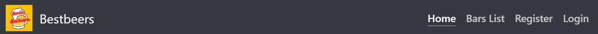

# Berlin Bestbeers - A beer map of Berlin

As my fourth portfolio project (PP4) with Code Institute, I created a website with a blog application in Django built for people who enjoy craft beer. It is targeted towards people who want to find craft beer bars around Berlin, Germany.
The purpose of this webpage is to allow users to participate posting their experiences on craft beer bars, upload fotos, comment and like on other posts.

[View the live project here.](https://berlin-bestbeers.herokuapp.com/)



## Index – Table of Contents
* [User Experience (UX)](#user-experience-ux)
  * [Project Goals:](#project-goals)
  * [Strategy used:](#strategy-used)
 * [Agile Workflow](#agile-workflow)
   * [User stories:](#user-stories)
      * [EPIC Admin Account management](#epic-admin-account-management)
      * [EPIC Post](#epic-post) 
      * [EPIC Like and Dislike](#epic-like-and-dislike) 
      * [EPIC Edit and Delete comment and posts](#epic-edit-and-delete-comment-and-posts) 
      * [EPIC UX and UI](#epic-ux-and-ui) 
 
* [Features](#features)
  * [Installed Features](#installed-features)
    * [Navigation bar:](#navigation-bar)
    * [Home page:](#home-page)
    * [Blog page: Bars List](#blog-page-bars-list)
    * [Register function:](#register-function)
    * [Login page:](#login-page)
    * [Logout page:](#logout-page)
    * [Add a post:](#add-a-post)
    * [Post detail:](#post-detail)
    * [Post update:](#post-update)
    * [Comment update:](#comment-update)
    * [Django Admin superuser:](#django-admin-superuser)
    * [System Feedback messages:](#system-feedback-messages)
    * [Footer:](#footer)
    * [Meta Data:](#meta-data)
  * [Features to Implement in the future](#features-to-implement-in-the-future)
* [Design](#design)
  * [Wireframes](#wireframes)
  * [Database Design](#database-design)
	  * [Classes:](#classes)
	  * [Site map](#site-map)
	  * [Colours used](#colours-used)
	  * [Typography](#typography)
	  * [Images](#images)
	  
* [Technologies](#technologies)
  * [Languages Used:](#languages-used)
  * [Frameworks and Libraries Used:](#frameworks-and-libraries-used)
  * [Software and Web Applications Used:](#software-and-web-applications-used)
* [Tests](#tests)
  * [Browser tests](#browser-tests)
  * [Responsiveness](#responsiveness)
  * [Validators:](#validators)
    * [W3C Markup Validator:](#w3c-markup-validator)
    * [W3C CSS Validator:](#w3c-css-validator)
    * [JSHint:](#jshint)
    * [PEP8 Online:](#pep8-online)
    * [Lighthouse test:](#lighthouse-test)
  * [Tests on user stories](#tests-on-user-stories)
  * [Further tests](#further-testing)
  * [Solved bugs](#solved-bugs)
  * [Known bugs](#known-bugs)
* [Deployment](#deployment)
* [Credits](#credits)
  * [Code](#code)
  * [Acknowledgements](#acknowledgements)

## User Experience (UX)

### Project Goals:
The main goal of this project is to design a blog for craft beer enthusiasts living in or travelling through Berlin, Germany. 
This website should allow a CRUD functionality, where each user can register an account, login into that, logout, create his/her own visits to craft beer bars around the city, as well as read, comment, update and delete posts and comments, without the need for an administrator to be present. 
The user should have full control over his own posts and comments.

### Strategy used:

Agile methodology was used to organize and plan this project, with assistance from the Kanban board on GitHub Project. 
As a starting point for the organization of this project, 5 EPICS were created, and within them, 27 tasks were mixed between USER and/or ADMIN Stories. 
Each task or story was designed to meet the blog user's needs, and labels were inserted to help to prioritize each task. 22 User Stories were concluded, working on this project and the remaining 5 were left to be implemented in the future.

Below is the construction of the project labels:

  - Must-Have: 17/27
  - Should-Have: 4/27
  - Could-Have: 4/27
  - Probably-Won’t-Have: 2/27



## Agile workflow

To this project, an agile workflow approach was used in the entire development. Some key ideas were adopted:

 - Focus first on the essential features
 - Work in small iterations
 - Adding extra features in case the time allowed
 - Using the GitHub kanban board, edits, tags and project resources to organize these iterations

### User stories:

  - #### 1. EPIC Admin Account management
    - USER STORY #7 - Account registration and/or login:
      - As a **user** I can **register an account and/or do my login** so that **I can update my visited beer bars, comment other posts and like**
    - USER STORY #7 - Manage all posts:
      - As an **admin** I can **create, read, update and delete posts and comments** so that **I can manage the content of my blog and avoid improper content**
    - USER STORY #32 - Create drafts:
      - As an **admin,** I can **create drafts of posts** so that **I can finalize my post after a while**
    - USER STORY #33 - Approve Commnts:
      - As a **admin** I can **approve or deny comments** so that **I can manage which comments can appear on my blog**

  - #### 2. EPIC Post
    - USER STORY #36 - View a bar list:
    - As a **user** I can **click on "Bars List" at the navigation bar** so that **I can see a list of all bars (posts) and decide in which one I go to comment afterward**
    - USER STORY #10 - Click on a post:
      - As a **user** I can **click on a post** so that **I can read it and interact with that**
    - USER STORY #11 - Create a new post:
      - As a **user** I can **creat a new post or more than one** so that **I can share my visit at a bar in berlin**
    - USER STORY #9 - View all posts:
      - As a **user** I can **view all posts of the blog** so that **I can select one bar to visit**
    - USER STORY #12 - Edit my posts
      - As a **user** I can **edit my own post** so that **I can update my point of view about a bar**
    
  - #### 3. EPIC: Like and Dislike 
    - USER STORY # 19 - View likes:
      - As a **user** I can **see the number of likes in each post** so that **I can have an idea about the best posts to read**
    - USER STORY #17 - See number of likes:
      - As a **user** I can **see the number of likes each post** so that **I can have an idea about the most visited bars**
    - USER STORY #20 - Like a post:
      - As a  **user**  I can  **like one or more posts**  so that  **I interact with other users**
    - USER STORY #21 - Dislike a post:
      - As a **site user** I can **see the weather conditions without entering the detail page for each post** so that **I can better select interesting posts**

  - #### 4. EPIC: Edit and Delete Comment and posts
    - USER STORY #22 - View comments:
      - As a **user** I can **see all comments** so that **I can read the comments and think If I come to visit this bar**
    - USER STORY #23 - Post a comment on others posts:
      - As a **user** I can **comment to posts** so that **I can interact with other uses and share my oppinions**
    - USER STORY #25 - Edit my comments:
      - As a **user** I can **edit my own posts** so that **I can do better comments or solve typo**
    - USER STORY #13 - Delete a post:
      - As a **user** I can **delete my own posts** so that **I can preserve my right to be invisible**
     - USER STORY #24 - Delete my comments:
       - As a  **user**  I can  **delete my comments**  so that  **I can interact with the content**

  - #### 5. EPIC UX and UI
    - USER STORY #26 - Responsiveness:
      - As a **user** I can **open the site in all gadgets I have (laptop, mobile and iPad)** so that **I can access the site anytime**
    - USER STORY #27 - Design:
      - As a **user** I can **have a very good impression of the site** so that **I always want to be connected there**
    - USER STORY #28 - System messages:
      - As a  **user**  I can  **get some system messages when interacting with the site**  so that  **I understand how the website acts**
    - USER STORY #30 - Favicon:
      - As a **user** I can **see a favicon at the tab of the site** so that **I can easily recognize the website in between all ma open tabs**
   
## Features

### Installed Features

#### Navigation bar:

The navbar was built with bootstrap's built-in class fixed-top, so the navigation bar is fixed on the top. When the page is scrolled by the user, the navigation bar stays fixed ont the top of the browser, and always visible to the user.

The logo was designed with [Canva](https://www.canva.com/) and is on the left of the navigation bar, close to the name of the site (Bestbeers). The logo is hyperlinked to the homepage of the site, and the font used was Poppins with font-family Roboto, used to the entire website. The Font Awesome was implemented into the base.hmtl.

The navigation items appear according to the user status. If logged in, the user can see the Home / Bars List / Add a Post / Logout / Username. This last includes a Font Awesome icon (fas fa-user):



Otherwise, the following items will appear: Home / Bars List / Register / Login:



For small devices the navbar is collapsed into a "hamburger menu", and turns to a fully responsive navigation bar. Here the example for the navbar tested on iPhone 5 viewport:



#### Home page:

##### Home page - Hero section:

The hero section is the first section of the home page that follows the navigation bar. It includes a background image featuring the yellow part of a beer and its "bubbles".

The background image uses background attachment fixed on large screen sizes to give a nice effect when the page is scrolled.



A large text overlay of this background image is the name of the website ("Bestbeers") wrote in red in **h1** and the location of that (Berlin, Germany) in **h2**.  
Underneath the overlayed text there is a button which redirects the users to the following: 
- To non-logged in users, the button "**Register Now**" redirects the users to register theirselves.
- To whom is already logged in, the button shows then mention "**See all posts here**", and this user will be redirect to the "**Bars List**", one of the page of the navigation bar, wchich shows a list of all bars posted.

The hero image shows clearly to all first time users that that is a beer lovers blog.  the user visits the site for the first time, they will clearly see that this is a fly fishing blog.

Hero image mobile devices: mobile phone and iPad:
|  |  |
|--|--|

##### Home page - Info section:

Below the Hero section is the Info section, a container styled with help of Font Awesome icons (3), designed to show the user a greater complicity with those who appreciate beers. Different colours and format were styled around the icons. This section gives to users a complete idea about the website's purpose, and how this bar guide works. 

  - Name of the blog - Bestbeers - Berlin's best beer bars! - (fa-solid fa-wine-bottle)
  - We LOVE Beer - Since 2023 - (fa-solid fa-heart)
  - From - Berlin, Germany (fa-solid fa-location-dot)



The circle around each icon was styled to get a different style (border-radius:  70%  30%  30%  70% / 60%  40%  60%  40%;)
When open the blog on smaller devices the number of icons reduces to only one - the middle positioned ones.

##### Home page - Posts section:

Still at the home page, underneath the Info section, the user can see the last 6 most recent posts of other users. This provided a quickly view of all updates done recently. 

This section was built with Bootstrap grid scheme, in which consists of three columns and two rows of posts, totaling 6 posts. All posts includes:

  - A featured image - Image uploaded by the user when creating a post. In case the user doesn't upload any image, a placeholder photo of many craft beers will be displayed.
  - Author - post author
  - Name of the bar (or) Post title with maximal 30 characters
  - Content - post content
  - Date of posting - Post created on ___
  - Number of likes - Font Awesome icon (far fa-heart) followed by the number of likes
  - Number of comments - Font Awesome icon (far fa-comments) followed by number of comments



By clicking on a post, the user is redirected to the post detail page for that post.

#### Blog page: Bars List

The Bars List is a list of all posts in reverse order of creation, i.e. from the most up-to-date to the last up-to-date, totaling 12 posts in each page. This posts are being paginated, and this Bars List can easily be accessed using the navigation bar link for all users, registered or not.

The Bars List page has the same grid Scheme as the Home Page, but contains 12 posts in each page and the pagination in the end of the page. The Hero image and the Info section don't appear in this list to make it more compact and in let it on a list format.
For small screens (mobile) the view changes to one post after another and the user has to scroll the screen post to post.

|  |  |
|--|--|

This list gives to users several options to enjoy the content, clicking it up and ineract with others.
By clicking on one post, the user will be redirected to the post detail page for that post.

#### Register function:

All users can register theirselves to start to interact with the website and/or other users. 
To access the registration mode, the user have two ways:
  - Through the navbar link ("Register")
  - Through the button provided at the Hero Image: "Register Now!"

To create an user account, an username, a password and an optional email registration has to be provided.



From now this user has fully access to the entire website and its features for users. If the user clicks on "Login" button button by mistake, the also can access the Register link at the Login page.

#### Login page:

The website can be accessed from all users. But to get the fully interactivity (CRUD) to posts to whom is registered and logged in, and this user can post bars, comment in other's post, like and dislike. 

The Login access can be found at the navbar:


 


If the user clicks on "Register" button by mistake, the also can access the Login link at the Registration page.
When the user enters a correct username with a matching password and clicks on "Login" button, they will be redirected to the Home page.

#### Logout page:

The Logout page can be accessed using the provided navbar link that is present when a user is logged in. When the user clicks on Logout, they are directly logged out of their account and redirected to the Home page.



Clicking by "Cancel" button, the user will be redirected to the previously visitet page. 

#### Add a Post

Every registered users can post a new content - a new Bar. This feature can be accessed through the navigation bar. 
This feature is only available if a user chooses to register to the site and can be accessed using the provided navbar link. The user can share their experience at the bar or simply post as a recommendation with a photo of the bar shooted by their. This is possible thanks to the SummernoteWidget.



The adding post feature is the same to all users and has the fields:
Title, Content, Excerpt (to appears at the Bars List), Image upload button (only one photo each post can be uploaded), and the buttons "Submit" / "Cancel".

In case that the user doesn't upload any photos, a default placeholder photo will be displayed. 

When the user complets all fields, and clicks on "Submit", the post will takes place to the datenbase as a draft and wait for approval or rejection of the admin. 
The proposal of that approval or rejecting feature is that to avoid the repetition of Bars. So the "Bars List" can turn on a list or even a "guide" of the best beer bars or brewery in Berlin.
Users can also click on "cancel" in order to not to send their posts. 



#### Post detail

When a post is clicked on by the user, the Post Detail page opens up, and shows a headline with the name of the Bar/Post. Underneath is the Post Author's name and the date of posting. In large viewports the photo uploaded by the Autor will be displayed in the headline beside of the name.

 - Logged users: comment and like/dislike will be offered as interaction. When a logged in user comments a post, he sees a field to write a comment and the button "Comment".
 




 - Non-logged users: the Post Detail and comments at this post are been showing, but without the feature to comment and/or like. This user will have the possibility to read all posts, navigate through the entire website, and if he wants, registrate himself to be get the interactions parts of the website. 

 All users can see, when inside of a post, the number of likes and comments. The interaction with them depends on the status (logged or non logged) of the user.
 Font Awesome icons (fa-heart and fa-comment) are used to display better the intention of the feature. The like and it changes the colour when clicked on. 



Font Awesome icon (fa-heart) changes colour and the user will be able to like/unlike the post.

  - If user is post author:
As a post author, the user will have all access to the CRUD functionality: post bars, comment posts, update his/her own posts, delete his/her own posts, like and dislike other's posts. 
If the author updates a poosts and decide not to post, he/she can click on "Cancel" button. Underneath is how the users can see their posts when they want to delete some of them:



  - User is comment author:
The comment author can write comments, edit and/or delete his/her own comments. This full CRUD functionality over their comments can provide a better interaction of all registered users in the website. 
Just like posts, all comments need admin approval, so there is no repetition of bars and also no problems with comments.
Buttons Update Comment and Delete Comment have the pencil and trash bootstrap buttons "btn-signup badge" and "btn-del" respectively. 



#### Post update

Authors can update or delete their own posts using the Post Detail's Page, clicking at the button "Edit Post" or "Delete Post".  If the author decides not to update after clicking on the "Edit Post," button, he/her can click on "Cancel" button. 
It gives to the user author full control over their posts.

|  | |

Updating a post isn't necessary to be approved by the admin, and the post will be automatically updated.

#### Comment update:

The registered user can update their own comments, even in other's posts. It is part of the full control of the content of their own posts and comments. 


 


The comment will be updated immediately after clicking on "Update Comment" button. This feature can avoid grammatical errors on the content. 

>>>>>>> dc3839e2497e62ca3f15c5628a8a12109c5f2421

#### Django Admin superuser:

The Admin background page of Django makes it possible to admin the entire website by creation of a "superuser" account.
To access the Admin panel, the URL of the blog + /admin has to be inserted at the browser: 
https://berlin-bestbeers.herokuapp.com/admin

The admin can access all content and registered users of the website. The superuser will be albe to approve (from draft to approved) and delete a specific user, post or comment. In this case the bad content can be removed.  


(admin login)
admin view

#### System Feedback messages:

One-time notification will be displayed according to the actions of the users. This messages belongs to the django Framework, and were activated for the Berlin Bestbeers Blog. 

System/Flash messages are displayed as feedback for users when actions are completed and stays 2 seconds until be automatically removed. 

(todas as messagens aqui)

#### Footer:

The webiste Footer appears in all pages and is featured at the bottom. 2 sections are used to build the Fotter:

 - On the left side an "About" section was built, and contains the message about the educational purpose at this website, my GitHub repository connection in form of a Button with the Font Awesome icon. 
Below the Social Media links, including Font Awesome icons of Facebook, Twitter, Instagram and Youtube. The social media are actually being connecte do the home page of each social media, and it was built like this to shows the possibility of connection. 

 - The right side includes a embedded Berlin Beer Guide Google Map, with all craft beer bars, breweries and spots where craft beer can bought. This map belongs to the website [Berlin Love](https://withberlinlove.com/berlin-craft-beer/), and was kindly lend to use for educational purposes in this website. 
The purpose of this map is that users chose a bar or brewery of that, go visit and post their experiences at the Berlin Bestbeers. 
Themmap disappears in smaller devices.

(foto mapa e smaller)

#### Other features:

  - Logo - created with Canvas.
  

  - Favicon - Created with Canvas.

  - Links and buttons will change the colour when hovered over.

foto dos botoes com amarelo

#### Meta Data:
Berlin Best Beers Blog

### Features to Implement in the future

   - USER STORY #37 - Socia Media login:
As a future implementation this feature was postponed due to the initial needs of the project. Users can register an account and user their social media for that. 
    - USER STORY #15 - Same Bar Visit counter:
This feature will allow to users to post their bars more than one time and have access toa small "counter", so they can interact more and have fun with this feature.  
    - USER STORY #18 - Post Share button:
It will allow to the users to share their posted bars or visit in their social media or email. 

## Design

### Wireframes

At the begining of this project, the Balsamiq Wireframes was used to plan the wireframes of the website, its funcionalities for the users, and to get an idea about how it might look in large widths and mobile devices.

Below are the wireframes created, and its features:

 - Home:



 - Blog page:



Post detail:



Add post:



Mobile:



### Database Design

#### Classes
The **User** class is the default User class from Django. 
The key custom classes in this project to share theirs experiences at the Berlin craft beer bars is the **Post** class, when user is logged in, in which the logged users can have fully access to all features of the blog once they are logged in. 

|Post|         |
|--|--|
| type |  field name  |
| CharField  | title   |
| slugfield  | slug  |
| ForeignKey | author |
| DateTimeField | updated_on |
| TextField | content |
| CloudinaryField | featured_image |
| TextField  | excerpt |
| DateTimeField | created_on|
| IntegerField | status |
| DateTimeField | created_on|
| ManyToManyField | Likes |

The **Comment** class is used to represenst a block of text that a user creates to share their experiences.  A **Bar/Post** can have many **Comments** but each **Comment** can only belong to one **Bar/Post**. Each **Comment** can have only one **User** author, but each **User** author can write many **Comments**, in different **Bars/Posts**.

|Comment|         |
|--|--|
| type |  field name  |
| ForeignKey | post |
| CharField| name|
| EmailField| email|
| TextField| body |
| DateTimeField | created_on|
| BooleanField| approved|

**Likes**, **Dislikes** are also created as feature for registered users.

### Site Map:
Lucidchart was used to explain the main structure of the entire website and how to navigate in it:



### Colours used:
The palette colour used for Berlin Bestbeers was chosen thinking about the standard yellow colour of the beers. The dark parts like the navigation bar and the footer belongs to the Bootstrap and brought a good contrast with the yellow used one.



The HEX colours used:
  - #353542 - Dark, Text colour, Navbar and Footer
  - #F9FAFC - Light grayish - Background
  - #f6c101 - Suppernova, Hero image and Favicon parts
  - #fae96f - Yellow Crayola, Hero image parts
  - #E84610 - Red, Titel outlines and Delete Post button

  
### Typography

I have used font-family "Poppins" and "Roboto", family Lato, sans-serif 200, 300, 400 and 600. Since this fonts are easy to read and shows a give a very young appearance to the website, they are chosen.

The same font are used to catch the users attention at the name of the Site and name of all posts, which I used the red colour with a dark boarder. 



### Images

Some images used for updated posts were picked up from  original existed bars and breweries in Berlin. As this website was build for educational purposes only, it will not be released in order to not violate the rights of the real authors of these images.
Unfortunately the free image sites do not have all images that I want use.

## Technologies

### Languages Used:

  - HTML5
  - CSS3
  - JavaScript
  - Python

### Frameworks and Libraries Used:

  - [Bootstrap:](https://getbootstrap.com/) Bootstrap CSS Framework used for styling and to build responsive web pages.
  - [Cloudinary:](https://cloudinary.com/) Used to store all blog images and uploaded images.
  - [Django:](https://www.djangoproject.com/) Main Python framework used in the development.
  - [Django Allauth:](https://django-allauth.readthedocs.io/en/latest/index.html) Used for authentication and account registration.
  - [Django Crispy Forms:](https://django-crispy-forms.readthedocs.io/en/latest/) Used to simplify the rendering of Django forms.
  - [dj_database_url:](https://pypi.org/project/dj-database-url/) Used to allow database urls to connect to the postgres database.
  - [ElephantSQL:](https://www.elephantsql.com/) Used as the website's database.
  - [Gunicorn:](https://gunicorn.org/) Green Unicorn, used as the Web Server to run Django on Heroku.
  - [Summernote:](https://github.com/summernote/django-summernote) To provide a WYSIWYG editor for customizing new blog content and add images.

### Software and Web Applications Used:

  - [Am I Responsive:](http://ami.responsivedesign.is) To chek the responsive.
  - [Balsamiq:](https://balsamiq.com/) Used to create the wireframes.
  - [Canva:](https://www.canva.com/) To create the favicon and the hero image.
  - [Chrome DevTools:](https://developer.chrome.com/docs/devtools/) Used to test the response on different screen sizes, debugging and to generate a Lighthouse report to analyze page load.
  - [Font Awesome:](https://fontawesome.com/) Used to add icons for aesthetic and UX purposes.
  - [Git:](https://git-scm.com/) Git was used for version control by utilizing the Gitpod terminal to commit to Git and Push to GitHub.
  - [GitHub:](https://github.com/) GitHub is used to store the projects code after being pushed from Git and to create the Kanban board used for this project.
  - [Google Fonts:](https://fonts.google.com/) To import font family ’Cabin Sketch’ which is used throughout the site. Added fallback font sans-serif.
  - [Map of Google Maps:](https://withberlinlove.com/berlin-craft-beer/) A Map embeeded though the Google Maps Embed API at this project used in footer section. The page Berlin Love Website belongs to a close friend of mine who allowed me to insert at this project done for learning purposes.
  - [Heroku:](https://www.heroku.com/) For deployment and hosting of the application.
  - [HTML Validator:](https://validator.w3.org/) Check your code for HTML validation.
  - [JSHint:](https://jshint.com/) Check code for JavaScript validation.
  - [Lucidchart:](https://www.lucidchart.com/pages/) Used to create the site map.
  - [Scheme Colors:](https://www.schemecolor.com/) Used to create the main colour palette.
there is a fallback background colour set so the page still functions.
  - [W3 CSS Validator:](https://jigsaw.w3.org/css-validator/) Check your code for CSS validation.
  - [Grammarly:](https://www.grammarly.com/) Free Grammar Check.

## Tests

### Browser tests

This project was tested using Lenovo YogaSlim Laptop (14", 2021), with Windows 11 installed, using the following browsers:

  - Google Chrome Version 109.0.5414.120 (64-Bit)
  - Brave Version 1.48.158 Chromium: 110.0.5481.77 (64-Bit)
  - Edge Version 110.0.1587.41 (64-Bit)
 
I have tested the live application, and works in an iPad Mini iOS device using Safari Version 16.0 browser.

I also have tested this application with a Google Pixel 6 Device using a Chrome Browser Version 110.0.5481.63.

### Responsiveness

Chrome developer tool have been used to check the responsiveness.

  - The website was tested in many different gadgets with different screen sizes: 
  	- iPad Mini (768 x 1024 px)
  	- iPhone 5 (320 px wide)
  	- very large screens like 5K iMac Pro (5120 x 2880 px)

### Validators:

#### W3C Markup Validator:

W3C Markup Validator was used to find sintax errors. The source code of the live project was copied and pasted to check the entire code and no syntax erros were found. 



#### W3C CSS Validator:

To validate the CSS style of the project, the W3C CSS Validator Services were used and no errors were highlighted.



#### JSHint:

JSHint was used to validate the JavaScript - no errors showed.



#### PEP8 CI Python Linther:

PEP8 CI Python Linther (Python validator) used for these thests. The code passed without any errors on all files tested:

  - admin.py



  - forms.py



  - models.py



  - urls.py



  - views.py



#### Lighthouse Test:

The Lighthouse testing of Chrome develeper tools confirmed that although the all images were used in original sizes, the website, its colours and fonts provided an easy-read and accessible website. The performance of 72 can be easily imroved with the resize of all images. 



### Tests on user stories

To be sure that the suer stories work well, it were also tested one by one. All tests werde done manually, including the system feedback messages. All expectations were met.

 - ##### 1. EPIC Admin / Account management
	- Account registration
	- Login to an account
	- Feedback messages
	- Manage all posts
	- Create drafts:
        - Approve Commnts:

  - ##### 2. EPIC Post
    - View a bar list
    - Click on a post
    - Create a new post
    - View all posts
    - Edit own posts
    - View likes
    - See number of likes
    - Like a post
    - Dislike a post

  - ##### 4. EPIC: Edit and Delete Comment and posts
    - View comments
    - Post a comment on others posts
    - Edit my comments
    - Delete a post
    - Delete my comments:

  - ##### 5. EPIC UX and UI
    - Responsiveness:
    - Design
    - System messages
    - Favicon

 
### Further tests

  - Hover effect - Test done in all buttons and it works as expected.
  - Map funcionality - I have tested the Beer Map embeded at the footer and it works as expected.
  
### Solved bugs

  - Comments without names - In first instance, when a comment was posted, the name of the post's auhor didn't appear. This bug was solved thanks to the tutor's help, that instructed me this functionality.
  - Editing Comments returns to the home and not to the edited post one - This bug was fixed changing the return link at views.py. 
  - Lighthouse test Performance with a "?" - I have got a "?" signal at my Performance when testing with Lighthouse. I changed the test to the incognito window and have got better Performance. That's because I have some extensions installed at Googl Chrome. Thanks to Code Institute’s Slack Channel, this was solved.
  - Several small bugs while codding, which were all solved thanks to Slack Channel advices and tutor's help of Code Institute.

### Known bugs

  - Currently the detected bug at Google chrome Developer Tools Console ist the Google Maps API, because theBerlin Beer Guide Google Map belongs to the website [Berlin Love](https://withberlinlove.com/berlin-craft-beer/), and the map was kindly lend to use for educational purposes in this website. 


  
## Deployment

The application was deployed to Heroku and the databese stored at ElephantSQL. The steps to deploy are as follows:

  - Login to [Heroku](https://dashboard.heroku.com/apps) dashboard to get an overview of installed apps.
  - Click on New => Create new app.
  - Choose a name for your application (must be unique) and enter your location.
  - Click on Create app.
  - After creating your new application, navigate and click on the Resources tab.
  - In the Add-ons search bar enter Heroku Postgres => Select Heroku Postgres.
  - A pop-up window till appear, choose Plan name Hobby Dev - Free.
  - Click on Submit order form.
  - Navigate to the Settings tab => click on Reveal Config Vars.
  - Copy the DATABASE_URL url value to the clipboard.
  - In GitPod => Create a new env.py file on top level directory.
  - In the env.py file:
    - Set environment variables: os.environ[”DATABASE_URL"] = "Paste in Heroku DATABASE_URL Link”
    - Add in secret key: os.environ[”SECRET_KEY"] = "Make up your own randomSecretKey”
  - In Heroku => Navigate to the Settings tab => click on Reveal Config Vars.
  - Add SECRET_KEY to Config Vars with the randomSecretKey value previously chosen.
  - In the settings.py file:
    - Remove the insecure secret key and replace it with: SECRET_KEY = os.environ.get(’SECRET_KEY')
    - Update to use the DATABASE_URL: dj_database_url.parse(os.environ.get(”DATABASE_URL"))
  - Save all files and Make Migrations: python3 manage.py migrate
  - Login to [Cloudinary](https://cloudinary.com/) and navigate to the Cloudinary Dashboard.
  - Copy your CLOUDINARY_URL API Environment Variable to the clipboard.
  - In the env.py file:
    - Add Cloudinary URL: os.environ["CLOUDINARY_URL"] = ”cloudinary://paste in API Environment Variable”
  - In Heroku => Navigate to the Settings tab => click on Reveal Config Vars.
  - Add ’CLOUDINARY_URL’ to Config Vars with the in API Environment Variable value.
  - Add ’DISABLE_COLLECTSTATIC’ 1 to Heroku Config Vars (temporary, must be removed before final deployment).
  - In the settings.py file:
    - Add Cloudinary Libraries to installed apps (note: order is important) ’cloudinary_storage',  ’django.contrib.staticfiles', ’cloudinary',
    - Add the following code below STATIC_URL = ’/static/' to use Cloudinary to store media and static files:
      - STATIC_url = '/static/'
      - STATICFILES_STORAGE = ’cloudinary_storage.storage.StaticHashedCloudinaryStorage'
      - STATICFILES_DIRS = [os.path.join(BASE_DIR, ’static')]
      - STATIC_ROOT = os.path.join(BASE_DIR, ’staticfiles')
      - MEDIA_URL = '/media/'
      - DEFAULT_FILE_STORAGE = 'cloudinary_storage.storage.MediaCloudinaryStorage'
    - Link file to the templates directory in Heroku: TEMPLATES_DIR = os.path.join(BASE_DIR, ’templates')
    - Change the templates directory to: TEMPLATES_DIR: 'DIRS': [TEMPLATES_DIR],
    - Add Heroku Hostname to ALLOWED_HOSTS: ALLOWED_HOSTS = [”Your_Project_name.herokuapp.com”, ”localhost”]
  - Create 3 new folders on top level directory: media, static, templates
  - Create a Procfile on the top level directory
  - In the Procfile file:
    - Add the following code with your project name: web: gunicorn PROJ_NAME.wsgi
  - In the terminal: Add, Commit and Push.
  - In Heroku navigate to the Deploy tab => click on Deploy Branch.
  - When build process is finished click on Open App to visit the live site.
  - After deployed, the database was migrated to ElephandSQL, following the steps provided by Code Institute.

## Credits

  - [All bars mentioned:] A huge thank you to all bars and breweries posted and mentioned by the fake users created for tests.	
  - [Am I Responsive:](http://ami.responsivedesign.is) To check responsiveness of the website.
  - [Balsamiq:](https://balsamiq.com/) To create all wireframes.
  - [Bootstrap:](https://getbootstrap.com/docs/4.6/getting-started/introduction/) To style and to build the webpage.
  - [Canva:](https://canva.com/) Used to create the favicon and the hero image.
  - [Code Institute Slack Community:](https://app.slack.com/) The community was very helpful in 100% of the time.
  - [Code Institute Tutor Support:](https://app.slack.com/) For help and support.
  - [OHMyCode:](https://ohmycode.com.br/) As inspiration for using Django in some tutorials.
  - [Django documentation:](https://docs.djangoproject.com/en/4.1/) Everything you need to know about Django.
  - [Developer Mozilla:](https://developer.mozilla.org/) To research about HTML and CSS for this project. 
  - [Lucidchart:](https://www.lucidchart.com/pages/) Used to create the site map.
  - [Colorkit:](https://colorkit.co/) Used to create the main colour palette.
  - [Stack Overflow:](https://stackoverflow.com) For troubleshooting and FAQ.
  - [W3Schools:](https://www.w3schools.com) Online Web Tutorials.

### Acknowledgements

  - To my partner Conny for her patience and love, when I was under stress. To my mentor at Code Institute, Brian Macharia, to teach me some things in cases wchich I really did not understood. To Freddie Dermesonoglou to help me to understand how Django's Model works and to all tutors at cI who were there in my desparate moments. I won't never forget!
